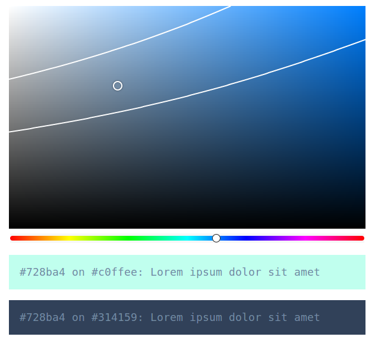

# react-contrast-picker

Color picker checking WCAG contrast ratio against multiple backgrounds.



## Usage

```javascript
import React, { useState } from 'react';

import ContrastPicker from 'react-contrast-picker';
import 'react-contrast-picker/dist/style.css';

export default function App() {
  const initialColor = '#728ba4';
  const backgrounds = ['#c0ffee', '#314159'];

  const [color, setColor] = useState(initialColor);

  return (
    <div>
      <ContrastPicker
        height="400px"
        ratio={4.5}
        compareWith={backgrounds}
        initialColor={initialColor}
        onChange={setColor}
      />
      {backgrounds.map((bg) => (
        <p key={bg} style={{ padding: '1em', backgroundColor: bg, color }}>
          {color} on {bg}: Lorem ipsum dolor sit amet
        </p>
      ))}
    </div>
  )
}
```
